# Codex 国风主题工坊

<p align="center">
  <strong>Codex Guofeng Themes</strong><br>
  持续扩展的 Codex 国风主题库与 Windows 一键换肤工具
</p>

<p align="center">
  <a href="https://github.com/mhh16399-collab/codex-guofeng-themes/actions/workflows/ci.yml"></a>
  <a href="./LICENSE"></a>
  
  
  
</p>

把山水、瓷器、织锦、壁画与东方色彩带进 Codex，同时保留清晰、可恢复的工作界面。项目持续增加原创国风主题、适配新版 Codex，并改进 Windows 注入器与安装体验。

不替换 Codex 程序文件，不修改 `WindowsApps`、`app.asar` 或应用签名。安装后可通过系统托盘在多套国风主题之间一键切换，也能导入自己的背景和 Safe CSS 主题包；恢复按钮可随时回到官方外观。

**[进入 Codex 国风主题馆](https://mhh16399-collab.github.io/codex-guofeng-themes/)** · 浏览全部主题、搜索筛选并查看安装说明。

> 当前发行目标仅为 Windows x64。项目基于 [Fei-Away/Codex-Dream-Skin](https://github.com/Fei-Away/Codex-Dream-Skin) 的 MIT 开源换肤内核开发，保留兼容状态目录与安全恢复机制。它是非官方项目，与 OpenAI 无隶属、赞助或背书关系。

## 持续更新

| 版本 | 进展 |
| --- | --- |
| v1.7.2 · 当前开发版 | 改进千里江山任务阅读层，清理原生粉紫色残留，并修复安装器开机启动权限问题 |
| v1.7.1 | 主题馆藏由 8 套扩展到 18 套；修复注入器退出后托盘状态误报，升级时自动刷新当前主题 CSS |
| v1.7.0 | 上线国风主题馆与首批 8 套馆藏，打通 Windows 安装、切换与安全恢复主流程 |

这里的版本号属于 **Codex Guofeng Themes 安装包**，不是 Codex 客户端版本。完整技术记录见 [Windows 更新日志](./windows/CHANGELOG.md)。

## 当前主题馆藏

主题目录由 [`catalog.json`](./windows/presets/catalog.json) 驱动，下面展示当前已收录作品；新主题会继续加入，而不是把现有数量当作上限。

### 竹青 · Zhuqing

纸白、竹影、青绿。清透安静，是全新安装的默认主题。


### 朱砂 · Zhusha

瓷白、朱砂宫墙、月洞与窗棂投影。克制的东方红，不做节庆堆饰。


### 墨韵 · Moyun

宣纸、远山、流水与飞白笔触。纯水墨空间，不与竹青重复植物意象。


### 汝窑天青 · Ruyao Tianqing

雨过天青、冰裂釉色与宋瓷陈设。低饱和青灰让工作区保持清雅、通透。

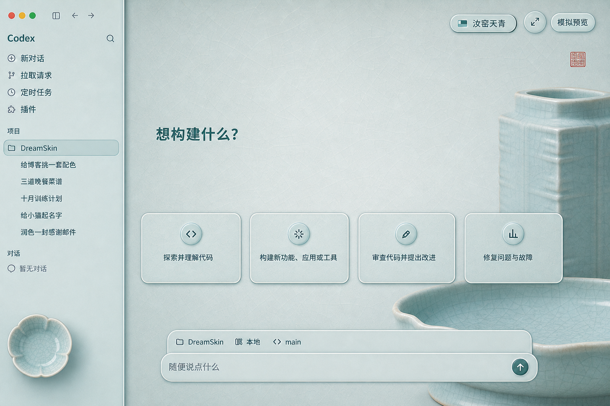

### 敦煌鎏金 · Dunhuang Liujin

飞天、藻井、矿物色与旧壁金线。暗色底衬托敦煌纹样，保留代码区的可读性。

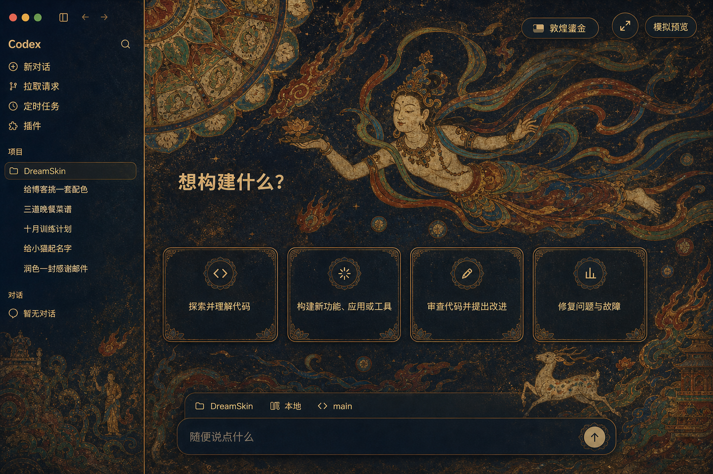

### 青花瓷 · Qinghua Ci

月白瓷面、青花折枝与器物留白。降低蓝色浓度，呈现温润而不刺眼的瓷韵。

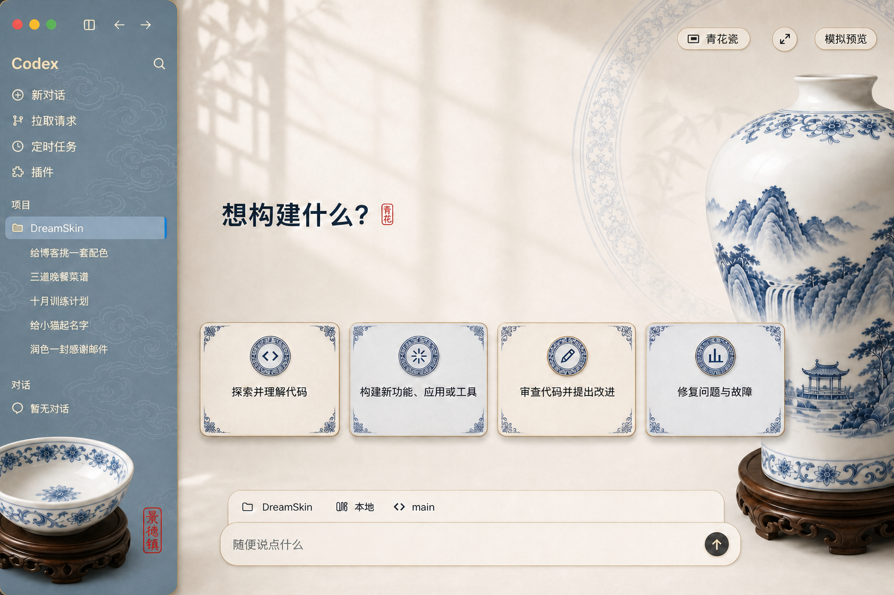

### 海棠宋锦 · Haitang Songjin

海棠纹、宋锦织理与暖金经纬。以织物层次丰富界面，不牺牲内容清晰度。

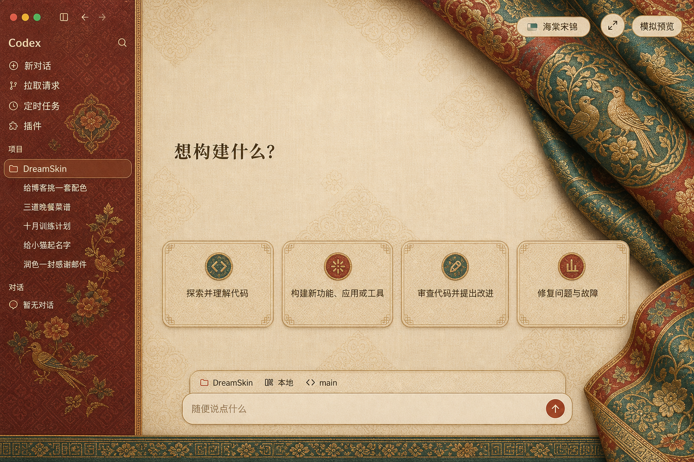

### 霁夜星河 · Jiye Xinghe

中国古代星图、黛蓝夜空与细金星轨。沉静深色适合夜间工作。

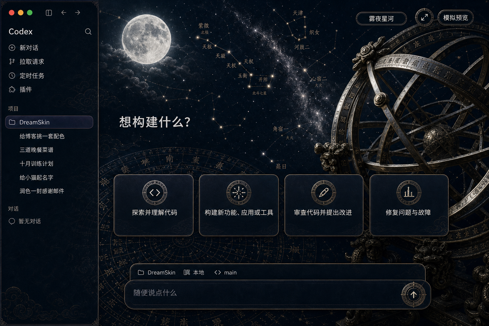

### 千里江山 · Qianli Jiangshan

石青、石绿、碧水与金线层峦。宋画气韵沿右侧展开，中央保持开阔易读。

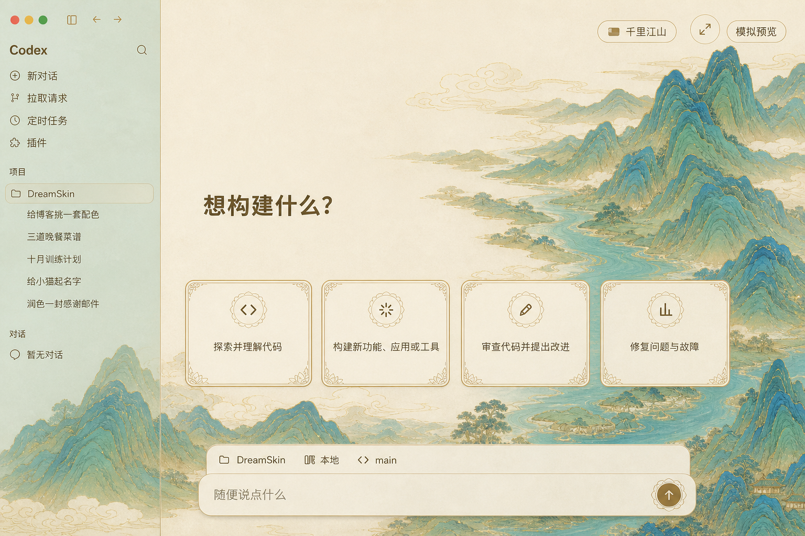

### 景泰华蓝 · Jingtai Hualan

深海军蓝展厅、松石釉彩与鎏金铜丝。华贵但克制的深色主题。

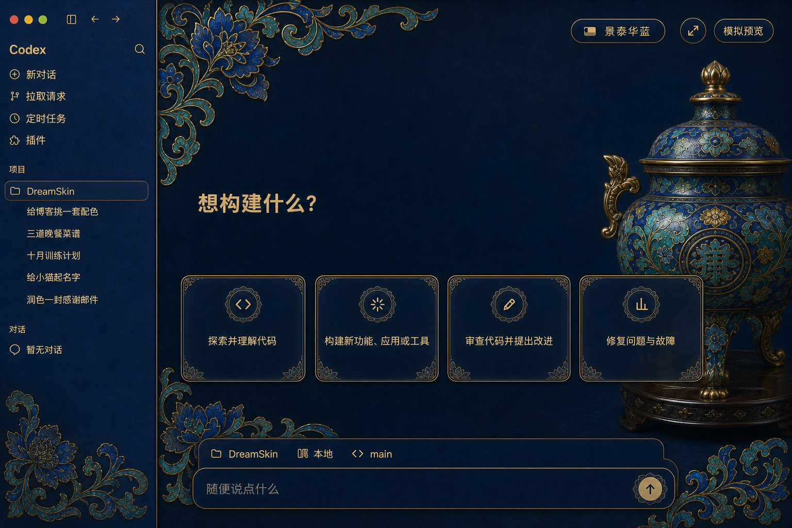

### 黑漆螺钿 · Heiqi Luodian

黑漆、螺钿鸟梅屏与贝母虹彩。低亮度工作区里保留细腻冷光。

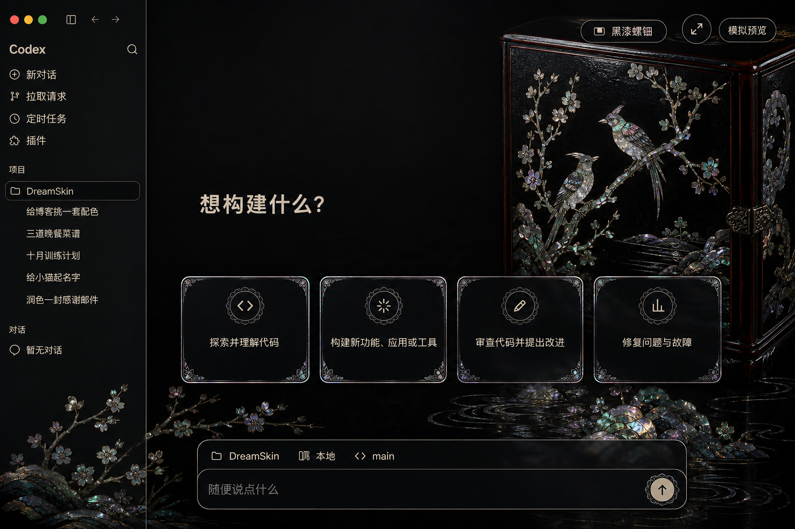

### 茶烟松风 · Chayan Songfeng

暖宣纸、松枝、紫砂与一缕茶烟。安静朴素，适合长时间阅读。

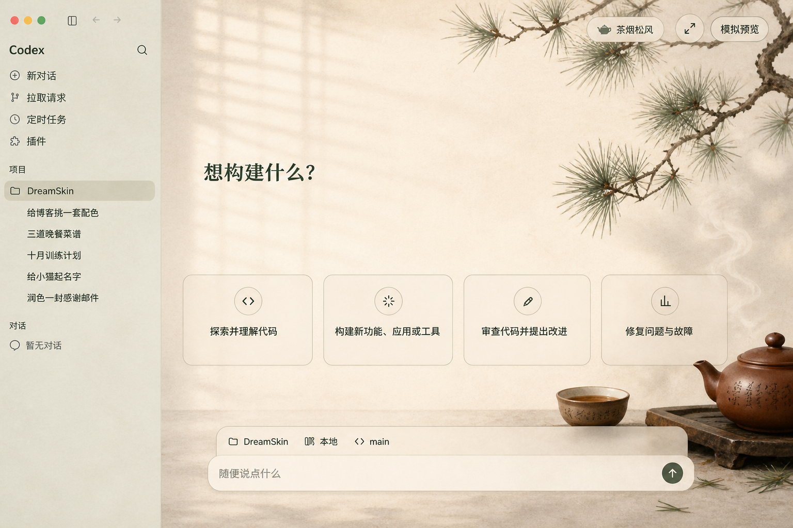

### 榫卯丹楹 · Sunmao Danying

斗拱、榫卯和营造图谱组织出的工程美学，以暖木和丹红收束层级。

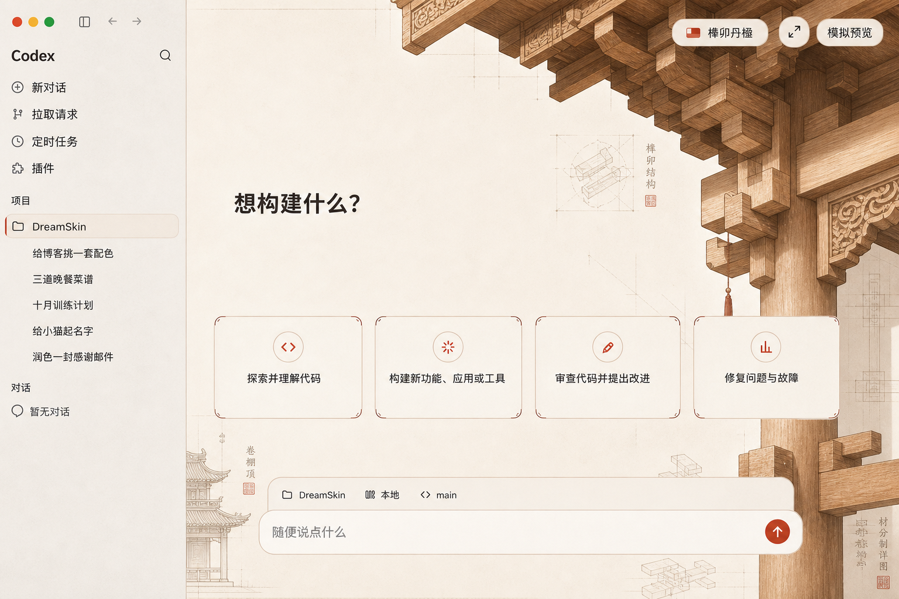

### 瑞鹤凌霄 · Ruihe Lingxiao

雾蓝云海、丹顶鹤与远处宫阙。轻盈明亮但不失细节。

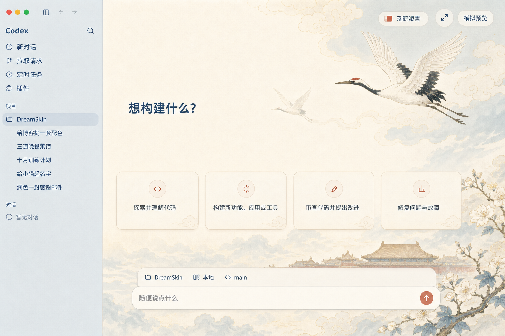

### 唐三彩 · Tang Sancai

乳白陶胎、三彩流釉和骏马器影。琥珀、橄榄与翠绿沿边缘流动。

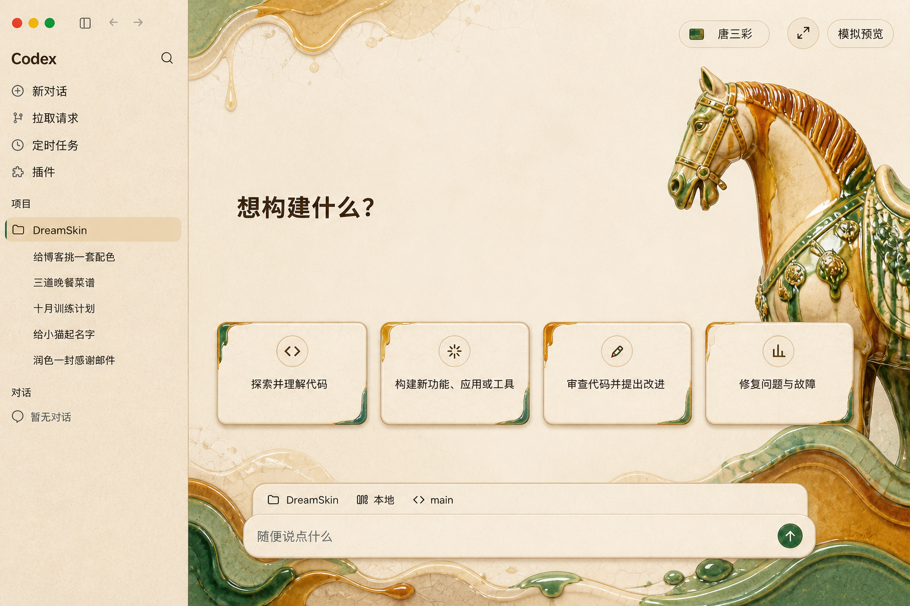

### 汉简墨痕 · Hanjian Mohen

焦茶、竹简、墨痕与青铜绿锈。沉静的考古书案式暗色主题。

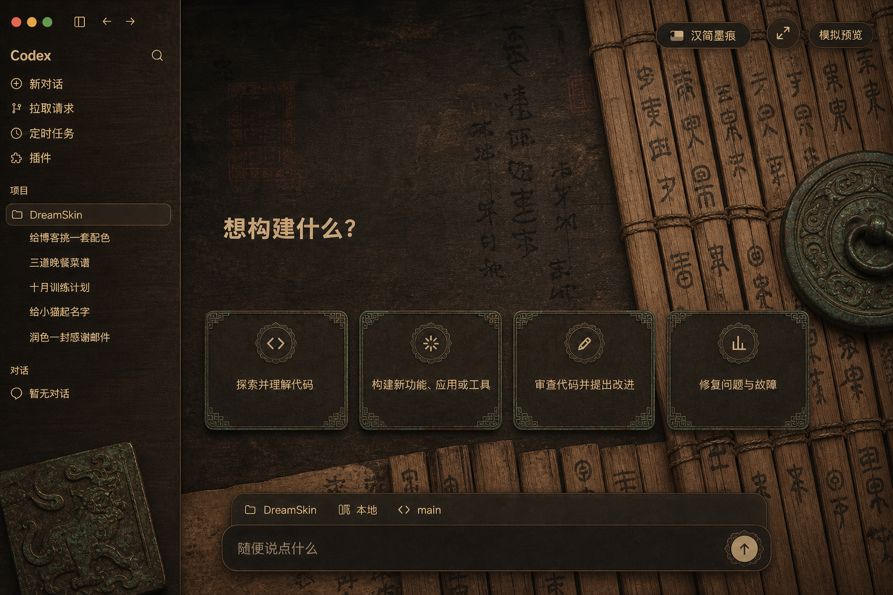

### 洛水流霞 · Luoshui Liuxia

靛青月夜、水城桥影与紫色流霞，玫瑰金微光沿水面展开。

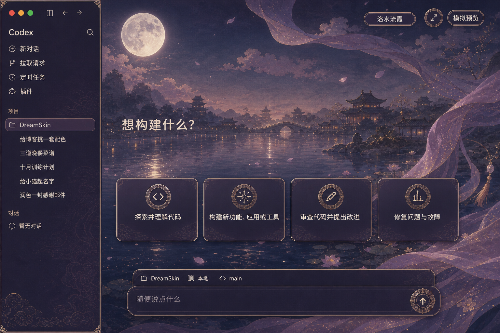

### 金陵云锦 · Jinling Yunjin

孔雀蓝、宝石绿与真金线织成孔雀羽团花，和海棠宋锦的暖红花卉路线清晰区分。

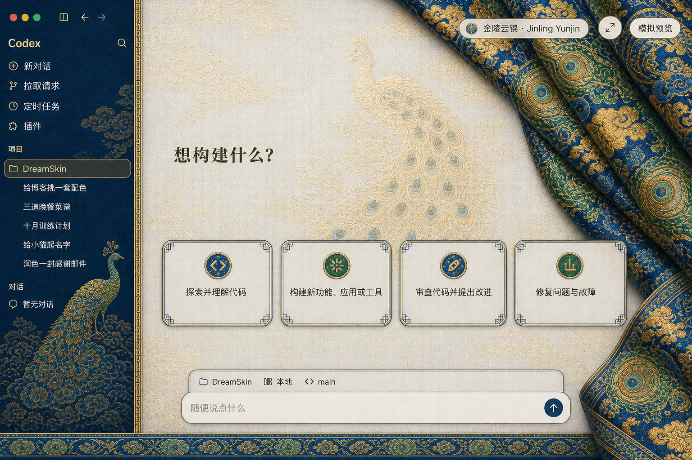

## 现在能做什么

- 托盘菜单一键切换多套内置主题
- 更换任意本地 JPG / PNG / WebP 背景
- 保存当前搭配，随时再次启用
- 导入经过边界检查与 Safe CSS 校验的主题 ZIP
- 暂停皮肤或完整恢复 Codex 官方外观
- 中英文托盘界面、同版本安装修复和更新检查
- 启动失败自动回滚；不接管系统目录，不绕过执行策略

## 安装

### 普通用户

首个 Guofeng Release 发布后，从本仓库 [Releases](https://github.com/mhh16399-collab/codex-guofeng-themes/releases) 下载 Windows 安装包。当前开发分支尚未发布正式安装包，请不要从第三方网盘下载。

### 从源码体验

要求 Windows 10+ x64、当前用户已安装官方 Microsoft Store `OpenAI.Codex`，以及 Node.js 22+。完全退出 Codex 后，在 PowerShell 进入仓库的 `windows` 目录：

```powershell
powershell.exe -NoProfile -ExecutionPolicy RemoteSigned -File .\scripts\install-dream-skin.ps1
```

安装后从开始菜单打开 **Codex Guofeng Themes**。托盘菜单内可直接选择当前内置主题。更完整的安装、验证、恢复和故障排查见 [Windows 使用说明](./windows/README.md)。

## 主题包结构

每套主题只有三个必要文件：

```text
my-theme/
├── background.jpg
├── theme.json
└── theme.css
```

`theme.css` 使用受限的 Safe CSS 合约：只允许白名单选择器与声明，禁止网络请求、脚本、伪元素和危险布局覆盖。可以参考 [`windows/presets/preset-zhuqing`](./windows/presets/preset-zhuqing) 制作新主题。

## 安全边界

- 只连接本机回环 CDP，并验证会话属于官方 Codex 包
- 不修改或解包官方应用，不更改 ACL，不需要管理员权限
- 主题导入限制文件数、体积、路径和扩展名，原子提交并支持回滚
- 安装器固定校验 Node.js 与所有审核主题的 SHA-256
- 内部继续使用 `%LOCALAPPDATA%\CodexDreamSkin` 和 `dreamskin://`，用于兼容上游升级、已有主题与恢复流程

安全问题请按 [`SECURITY.md`](./SECURITY.md) 私下报告，不要在公开 Issue 中附带 token、`auth.json`、私人对话或完整日志。

## 参与贡献

欢迎提交新的原创国风主题、Windows 兼容修复、文档和无障碍改进。开始前请阅读 [贡献说明](./.github/CONTRIBUTING.md)。主题作品必须有清晰的再分发权利，不接受未经授权的角色、名人肖像、品牌素材或直接搬运的商业壁纸。

新增或修改主题时，先运行增量检查，只校验本次变更的预设：

```powershell
.\windows\tests\run-theme-change-tests.ps1 -PresetIds preset-your-theme
```

增量检查会验证主题结构、图片、Safe CSS、主题馆预览、安装/修复清单和发行哈希。准备发布版本或改动换肤内核时，再运行 `windows\tests\run-tests.ps1` 全量回归；不要让日常单主题迭代重复跑全部历史 ZIP 安全矩阵。

## 致谢与许可

- 换肤与恢复内核源自 [Codex Dream Skin](https://github.com/Fei-Away/Codex-Dream-Skin)，感谢原作者与所有贡献者。
- 软件代码按 [MIT License](./LICENSE) 发布；OpenAI、Codex 和第三方商标不包含在该许可中。
- 国风背景为本分叉视觉资产，详细归属与第三方组件说明见 [`macos/NOTICE.md`](./macos/NOTICE.md)（安装包沿用该通知文件）。

---

## English

Codex Guofeng Themes is a Windows-only, unofficial theming layer for the official Codex desktop app. It provides a growing library of original Chinese-inspired themes, tray-based one-click switching, validation for imported theme packages and Safe CSS, and a safe path back to the official appearance without modifying the app package. See the Chinese sections above and the [Windows guide](./windows/README.md) for setup and safety details.
