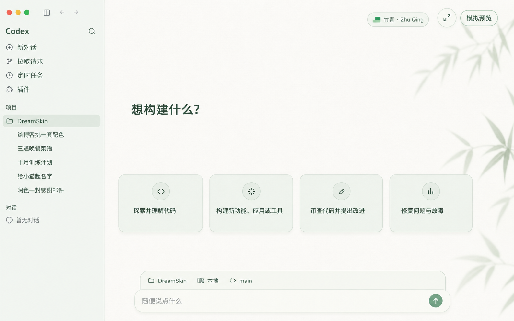
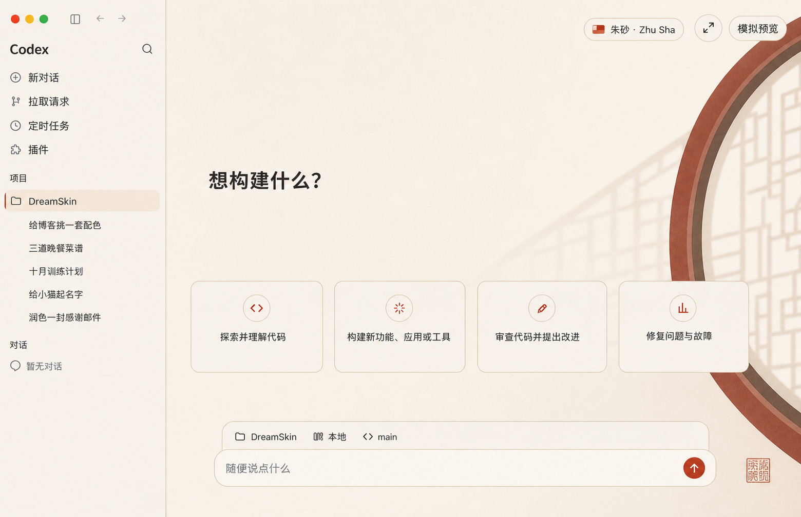
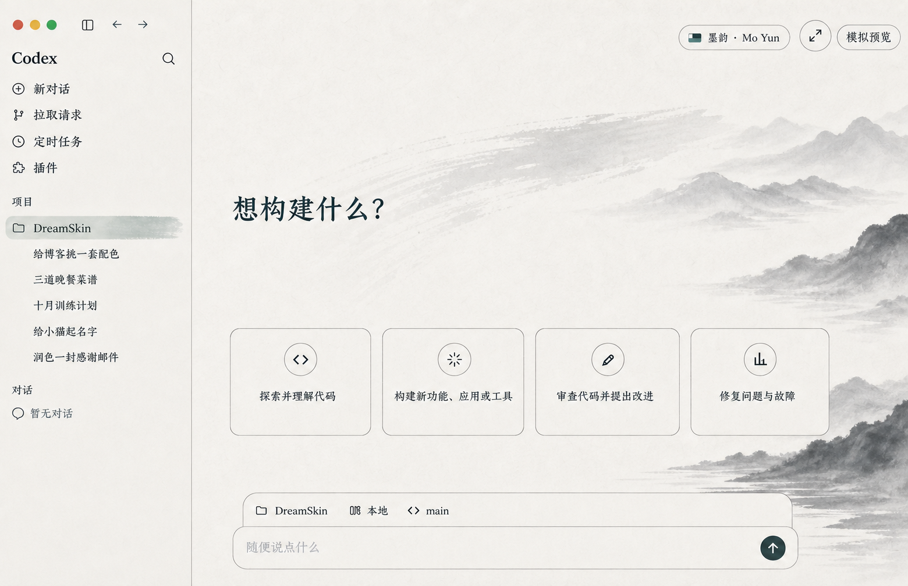

# Codex 国风主题工坊

<p align="center">
  <strong>Codex Guofeng Themes</strong><br>
  给 Codex Windows 桌面端的一键国风换肤工具
</p>

<p align="center">
  <a href="https://github.com/mhh16399-collab/codex-guofeng-themes/actions/workflows/ci.yml"></a>
  <a href="./LICENSE"></a>
  
  
</p>

不替换 Codex 程序文件，不修改 `WindowsApps`、`app.asar` 或应用签名。安装后通过系统托盘在竹青、朱砂、墨韵之间一键切换，也能导入自己的背景和 Safe CSS 主题包；恢复按钮可随时回到官方外观。

> 当前发行目标仅为 Windows x64。项目基于 [Fei-Away/Codex-Dream-Skin](https://github.com/Fei-Away/Codex-Dream-Skin) 的 MIT 开源换肤内核开发，保留兼容状态目录与安全恢复机制。它是非官方项目，与 OpenAI 无隶属、赞助或背书关系。

## 三套首发主题

### 竹青 · Zhuqing

纸白、竹影、青绿。清透安静，是全新安装的默认主题。



### 朱砂 · Zhusha

瓷白、朱砂宫墙、月洞与窗棂投影。克制的东方红，不做节庆堆饰。



### 墨韵 · Moyun

宣纸、远山、流水与飞白笔触。纯水墨空间，不与竹青重复植物意象。



## 现在能做什么

- 托盘菜单一键切换三套内置主题
- 更换任意本地 JPG / PNG / WebP 背景
- 保存当前搭配，随时再次启用
- 导入经过边界检查与 Safe CSS 校验的主题 ZIP
- 暂停皮肤或完整恢复 Codex 官方外观
- 中英文托盘界面、同版本安装修复和更新检查
- 启动失败自动回滚；不接管系统目录，不绕过执行策略

## 安装

### 普通用户

首个 Guofeng Release 发布后，从本仓库 [Releases](https://github.com/mhh16399-collab/codex-guofeng-themes/releases) 下载 Windows 安装包。当前开发分支尚未发布正式安装包，请不要从第三方网盘下载。

### 从源码体验

要求 Windows 10+ x64、当前用户已安装官方 Microsoft Store `OpenAI.Codex`，以及 Node.js 22+。完全退出 Codex 后，在 PowerShell 进入仓库的 `windows` 目录：

```powershell
powershell.exe -NoProfile -ExecutionPolicy RemoteSigned -File .\scripts\install-dream-skin.ps1
```

安装后从开始菜单打开 **Codex Guofeng Themes**。托盘菜单内可直接选择竹青、朱砂或墨韵。更完整的安装、验证、恢复和故障排查见 [Windows 使用说明](./windows/README.md)。

## 主题包结构

每套主题只有三个必要文件：

```text
my-theme/
├── background.jpg
├── theme.json
└── theme.css
```

`theme.css` 使用受限的 Safe CSS 合约：只允许白名单选择器与声明，禁止网络请求、脚本、伪元素和危险布局覆盖。可以参考 [`windows/presets/preset-zhuqing`](./windows/presets/preset-zhuqing) 制作新主题。

## 安全边界

- 只连接本机回环 CDP，并验证会话属于官方 Codex 包
- 不修改或解包官方应用，不更改 ACL，不需要管理员权限
- 主题导入限制文件数、体积、路径和扩展名，原子提交并支持回滚
- 安装器固定校验 Node.js 与三套审核主题的 SHA-256
- 内部继续使用 `%LOCALAPPDATA%\CodexDreamSkin` 和 `dreamskin://`，用于兼容上游升级、已有主题与恢复流程

安全问题请按 [`SECURITY.md`](./SECURITY.md) 私下报告，不要在公开 Issue 中附带 token、`auth.json`、私人对话或完整日志。

## 参与贡献

欢迎提交新的原创国风主题、Windows 兼容修复、文档和无障碍改进。开始前请阅读 [贡献说明](./.github/CONTRIBUTING.md)。主题作品必须有清晰的再分发权利，不接受未经授权的角色、名人肖像、品牌素材或直接搬运的商业壁纸。

## 致谢与许可

- 换肤与恢复内核源自 [Codex Dream Skin](https://github.com/Fei-Away/Codex-Dream-Skin)，感谢原作者与所有贡献者。
- 软件代码按 [MIT License](./LICENSE) 发布；OpenAI、Codex 和第三方商标不包含在该许可中。
- 三套国风背景为本分叉首发视觉资产，详细归属与第三方组件说明见 [`macos/NOTICE.md`](./macos/NOTICE.md)（安装包沿用该通知文件）。

---

## English

Codex Guofeng Themes is a Windows-only, unofficial theming layer for the official Codex desktop app. It bundles three original Chinese-inspired themes, provides tray-based one-click switching, validates imported theme packages and Safe CSS, and can restore the official appearance without modifying the app package. See the Chinese sections above and the [Windows guide](./windows/README.md) for setup and safety details.
